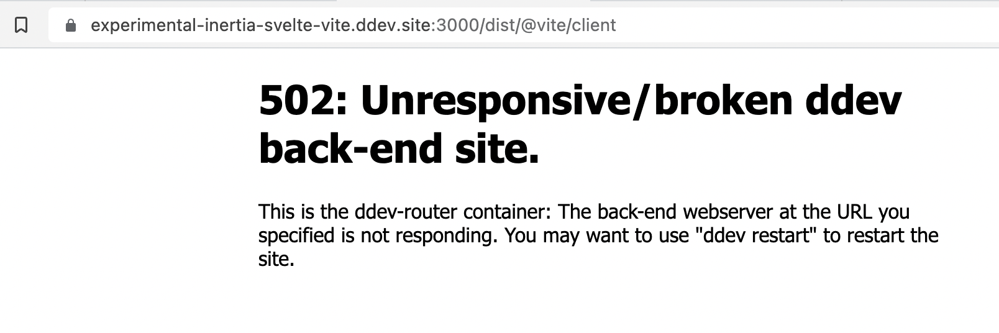
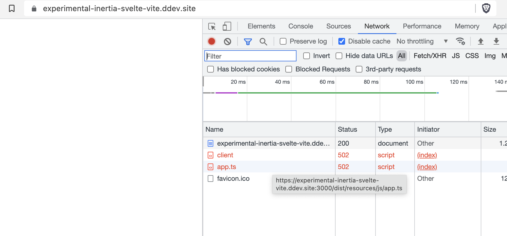
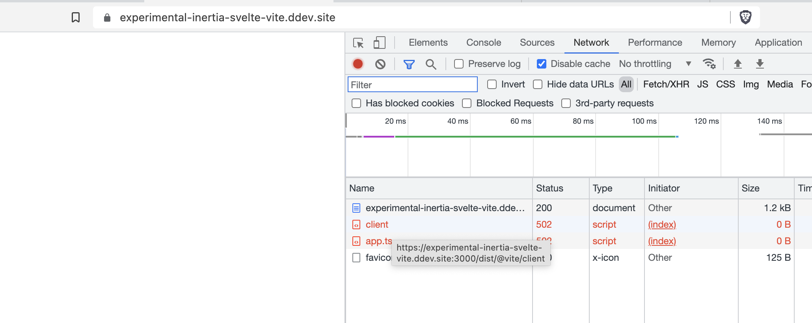

Status: Work in progress

-   Installed fresh inertia with svelte support
-   Trying to add https://laravel-vite.dev/ via [Installation in an existing project](https://laravel-vite.dev/guide/quick-start.html#before-starting)
-   Current state:
    -   `ddev exec npm run build` -> works
    -   `ddev exec npm run dev` -> doesn't work (routing to localhost:3000/ doesn't work, see screenshots below)

Current errors: 






- DDEV Discord thread https://discord.com/channels/664580571770388500/959490250474938489
- There is a working example for standalone PHP usage in combination with vite 2.6.4 https://github.com/iammati/vite-ddev, therefore it seems to be a configuration issue with Laravel Vite 🤔

## Launch via Gitpod

[](https://gitpod.io/#DDEV_REPO=https%3A%2F%2Fgithub.com%2Fmandrasch%2Fexperimental-inertia-svelte-vite,DDEV_ARTIFACTS=/https://github.com/drud/ddev-gitpod-launcher/)

After launching the project, run these steps in the Gitpod terminal to create the initial config:

```bash
cd experimental-inertia-svelte-vite/ && \
    ddev start && \
    ddev exec "cat .env.example | sed  -E 's/DB_(HOST|DATABASE|USERNAME|PASSWORD)=(.*)/DB_\1=db/g' > .env" && \
    ddev artisan key:generate && \
    ddev artisan migrate && \
    ddev exec npm install && \
    ddev exec npm run build && \
    gp preview $(gp url 8080)
```

_(You can as well use this repo locally via DDEV-local, https://ddev.readthedocs.io/en/stable/)_

## How was this created?

### 1. DDEV Laravel Composer Quickstart

```
mkdir my-laravel-app
cd my-laravel-app
ddev config --project-type=laravel --docroot=public --create-docroot
ddev start
ddev composer create --prefer-dist laravel/laravel
ddev exec "cat .env.example | sed  -E 's/DB_(HOST|DATABASE|USERNAME|PASSWORD)=(.*)/DB_\1=db/g' > .env"
ddev exec "php artisan key:generate"
ddev launch
```

See: https://ddev.readthedocs.io/en/stable/users/cli-usage/#laravel-composer-setup-example

### 2. Inertia installation

```
ddev composer require inertiajs/inertia-laravel
```

Add root template (create `resources/views/app.blade.php` and paste code from https://inertiajs.com/server-side-setup. Create middleware:

```
ddev artisan inertia:middleware
```

and add this as last item to `app/Http/Kernel.php`:

```
'web' => [
    // ...
    \App\Http\Middleware\HandleInertiaRequests::class,
],
```

Next - client side setup (https://inertiajs.com/client-side-setup):

```
ddev exec npm install @inertiajs/inertia @inertiajs/inertia-svelte
ddev exec npm install laravel-mix-svelte
```

Add _laravel-mix-svelte_ to `webpack.mix.js`:

```javascript
const mix = require("laravel-mix");
require("laravel-mix-svelte");

mix.js("resources/js/app.js", "public/js")
    .postCss("resources/css/app.css", "public/css", [
        //
    ])
    .svelte({
        dev: !mix.inProduction(),
    })
    .webpackConfig({
        output: { chunkFilename: "js/[name]. js? id = [chunkhash]" },
    })
    .version(); // cache busting
```

Overwrite `resources/js/app.js` with

```javascript
import { createInertiaApp } from "@inertiajs/inertia-svelte";

createInertiaApp({
    resolve: (name) => require(`./Pages/${name}.svelte`),
    setup({ el, App, props }) {
        new App({ target: el, props });
    },
});
```

Create a page, e.g. `resources/js/Pages/Welcome.svelte`

```
<script>
  let user = 'Svelte Testperson';
</script>

<svelte:head>
   <title>Welcome</title>
</svelte:head>

<h1>Welcome</h1>
<p>Hello {user}, welcome to your first Inertia app!</p>

```

Render it as index page via `routes/web.php`:

```
<?php

use Illuminate\Support\Facades\Route;
use Inertia\Inertia;

Route::get('/', function () {
    return Inertia::render("Welcome");
});
```

Launch it in your browser via `ddev launch`.

### 3. Trying to replace Laravel Mix with Laravel vite

Docs: https://laravel-vite.netlify.app/guide/quick-start.html#installation-in-an-existing-project

```
ddev exec "composer require innocenzi/laravel-vite:0.2.*"
ddev exec npm i -D vite vite-plugin-laravel
ddev exec npm install --save-dev @sveltejs/vite-plugin-svelte
```

Create `vite.config.ts`:

```javascript
import { defineConfig } from "vite";
import svelte from "@vitejs/plugin-svelte";
import laravel from "vite-plugin-laravel";

export default defineConfig({
    plugins: [svelte(), laravel()],
});
```

Add vite config (PHP):

```
ddev artisan vendor:publish --tag=vite-config
```

TODO: do we need this?

Edit `package.json` for vite scripts:

```json
  "scripts": {
        "dev": "vite",
        "build": "vite build",
        "preview": "vite preview"
      },
```

Change `resources/js/app.js` file, use import instead of require:

```
import '../css/app.css';

import { createInertiaApp } from '@inertiajs/inertia-svelte'

createInertiaApp({
    resolve: async name => await import(`./Pages/${name}.svelte`),
    setup({ el, App, props }) {
        new App({ target: el, props })
    },
})
```

TODO: is this the correct/reliable way?
